# 🖼️ Image Annotation Processing Scripts 🧠

This repository contains a set of Python scripts for processing, augmenting, and visualizing image annotations for machine learning datasets. These scripts are designed to work with object detection or instance segmentation tasks.

## 📚 General Information

The repository consists of four main Python scripts:

1. `json_combo.py`: 🔄 Combines multiple annotation files and images into a single dataset.
2. `train_val_split.py`: ✂️ Splits the combined dataset into training and testing sets.
3. `augment.py`: 🔬 Performs data augmentation on the training and testing sets.
4. `plotting.py`: 🎨 Visualizes the annotations by plotting contours on the images.

## 🔍 Detailed Script Workflows

### 1. json_combo.py 🔄

This script combines multiple annotation files and images from separate folders into a single dataset.

Workflow:
1. 📂 Scans through all input folders containing images and their COCO format annotations.
2. 🖼️ Plots annotations for each image in its original folder.
3. ⚠️ If any image is not found, the process stops and reports the missing image.
4. 🚫 Ignores any images specified in a predefined list.
5. 🔗 Combines all JSON annotation files into a single file.
6. 📁 Copies all valid images into a single output folder.
7. 🎨 Plots annotations for all images in the combined dataset.

Input:
- Multiple folders containing images and their COCO format annotations

Output:
- `combined_data/combined_json.json`: Combined annotation file
- `combined_data/images/`: Folder containing all combined images
- `annotation_check/`: Folder containing visualizations of annotations (both original and combined)

### 2. train_val_split.py ✂️

This script splits the combined dataset into training and testing sets.

Workflow:
1. 📊 Loads the combined JSON data.
2. 🔍 Verifies that all images in the JSON file exist in the combined images folder.
3. 🎲 Randomly splits the dataset into training and testing sets based on a specified ratio.
4. 💾 Saves separate JSON files for training and testing annotations.
5. 📋 Copies the corresponding images into train and test folders.
6. 🖼️ Plots annotations for both training and testing sets.

Input:
- `combined_data/combined_json.json`
- `combined_data/images/`

Output:
- `train_test_split/train/train.json`: Training set annotations
- `train_test_split/test/test.json`: Testing set annotations
- `train_test_split/train/images/`: Training set images
- `train_test_split/test/images/`: Testing set images
- `annotation_check/train/`: Visualizations of training set annotations
- `annotation_check/test/`: Visualizations of testing set annotations

### 3. augment.py 🔬

This script performs data augmentation on the training and testing sets.

Workflow:
1. 📁 Loads training and testing data from the split datasets.
2. 🔧 Applies various augmentation techniques (e.g., random brightness/contrast, Gaussian blur).
3. 🖼️ Generates new augmented images.
4. 📝 Updates annotation data for the augmented images.
5. 💾 Saves new JSON files with original and augmented data.
6. 🎨 Plots annotations for both original and augmented images.

Input:
- `train_test_split/train/train.json`
- `train_test_split/test/test.json`
- `train_test_split/train/images/`
- `train_test_split/test/images/`

Output:
- `aug_train_test_split/train/train_split.json`: Augmented training set annotations
- `aug_train_test_split/test/test_split.json`: Augmented testing set annotations
- `aug_train_test_split/train/images/`: Augmented training set images
- `aug_train_test_split/test/images/`: Augmented testing set images
- `annotation_check/aug_train/`: Visualizations of augmented training set annotations
- `annotation_check/aug_test/`: Visualizations of augmented testing set annotations

### 4. plotting.py 🎨

This script provides additional visualization of the annotations for the augmented datasets.

Workflow:
1. 📊 Loads the augmented training and testing datasets.
2. 🖼️ For each image in both datasets:
   - Draws contours around the annotated objects.
   - Adds a text overlay with the contour count.
3. 💾 Saves the visualized images in separate folders for easy inspection.

Input:
- `aug_train_test_split/train/train_split.json`
- `aug_train_test_split/test/test_split.json`
- `aug_train_test_split/train/images/`
- `aug_train_test_split/test/images/`

Output:
- `annotation_check/custom_aug_train/`: Visualizations of augmented training set annotations
- `annotation_check/custom_aug_test/`: Visualizations of augmented testing set annotations

## 🔄 Workflow Flowchart

```mermaid
graph TD
    A[🚀 Start] --> B[Run json_combo.py]
    B --> C[Run train_val_split.py]
    C --> D[Run augment.py]
    D --> E[Run plotting.py]
    E --> F[🏁 End]

    subgraph "json_combo.py"
    B1[📂 Scan input folders]
    B2[🖼️ Plot original annotations]
    B3[🚫 Check for missing images]
    B4[🔗 Combine JSON files]
    B5[📁 Merge images into single folder]
    B6[🎨 Plot combined annotations]
    B1 --> B2 --> B3 --> B4 --> B5 --> B6
    end

    subgraph "train_val_split.py"
    C1[📊 Load combined data]
    C2[🔍 Verify images]
    C3[✂️ Split dataset]
    C4[💾 Save split annotations]
    C5[📋 Copy split images]
    C6[🖼️ Plot split annotations]
    C1 --> C2 --> C3 --> C4 --> C5 --> C6
    end

    subgraph "augment.py"
    D1[📁 Load split datasets]
    D2[🔧 Apply augmentations]
    D3[🖼️ Generate augmented images]
    D4[📝 Update annotations]
    D5[💾 Save augmented data]
    D6[🎨 Plot augmented annotations]
    D1 --> D2 --> D3 --> D4 --> D5 --> D6
    end

    subgraph "plotting.py"
    E1[📊 Load augmented datasets]
    E2[🖼️ Draw contours]
    E3[📝 Add text overlays]
    E4[💾 Save visualized images]
    E1 --> E2 --> E3 --> E4
    end

    B --> C
    C --> D
    D --> E
```



This flowchart illustrates the detailed sequence of operations performed by each script, from combining the initial datasets to the final visualization of the augmented and annotated images.

## 🚀 Usage

1. Place your image folders in the root directory.
2. Run the scripts in the following order:
   ```
   python json_combo.py
   python train_val_split.py
   python augment.py
   python plotting.py
   ```
3. Check the output folders for the processed datasets and visualizations.

## 🛠️ Requirements

- Python 3.6+
- PIL (Pillow)
- numpy
- tqdm
- albumentations (for augment.py)

Install the required packages using:
```
pip install pillow numpy tqdm albumentations
```

## 📝 Note

Make sure you have sufficient disk space, as the augmentation process will create multiple copies of the images.

## 🌟 Happy Annotating! 🌟