# 🖼️ Image Annotation Processing Scripts 🧠

This repository contains a set of Python scripts for processing, augmenting, and visualizing image annotations for machine learning datasets. These scripts are designed to work with object detection or instance segmentation tasks.

## 📚 General Information

The repository consists of four main Python scripts:

1. `json_combo.py`: 🔄 Combines multiple annotation files and images into a single dataset.
2. `train_val_split.py`: ✂️ Splits the combined dataset into training and testing sets.
3. `augment.py`: 🔬 Performs data augmentation on the training and testing sets.
4. `plotting.py`: 🎨 Visualizes the annotations by plotting contours on the images.

These scripts work together to prepare and visualize a dataset for various machine learning tasks, enhancing the quality and quantity of your training data.

## 📥 Input and Output 📤

### json_combo.py
- **Input**: 
  - Multiple folders containing images and their COCO format annotations
- **Output**: 
  - `combined_data/combined_json.json`: Combined annotation file
  - `combined_data/images/`: Folder containing all combined images
  - `annotation_check/`: Folder containing visualizations of the combined annotations

### train_val_split.py
- **Input**: 
  - `combined_data/combined_json.json`
  - `combined_data/images/`
- **Output**: 
  - `train_test_split/train/train.json`: Training set annotations
  - `train_test_split/test/test.json`: Testing set annotations
  - `train_test_split/train/images/`: Training set images
  - `train_test_split/test/images/`: Testing set images
  - `annotation_check/train/`: Visualizations of training set annotations
  - `annotation_check/test/`: Visualizations of testing set annotations

### augment.py
- **Input**: 
  - `train_test_split/train/train.json`
  - `train_test_split/test/test.json`
  - `train_test_split/train/images/`
  - `train_test_split/test/images/`
- **Output**: 
  - `aug_train_test_split/train/train_split.json`: Augmented training set annotations
  - `aug_train_test_split/test/test_split.json`: Augmented testing set annotations
  - `aug_train_test_split/train/images/`: Augmented training set images
  - `aug_train_test_split/test/images/`: Augmented testing set images
  - `annotation_check/aug_train/`: Visualizations of augmented training set annotations
  - `annotation_check/aug_test/`: Visualizations of augmented testing set annotations

### plotting.py
- **Input**: 
  - `aug_train_test_split/train/train_split.json`
  - `aug_train_test_split/test/test_split.json`
  - `aug_train_test_split/train/images/`
  - `aug_train_test_split/test/images/`
- **Output**: 
  - `annotation_check/custom_aug_train/`: Visualizations of augmented training set annotations
  - `annotation_check/custom_aug_test/`: Visualizations of augmented testing set annotations

## 🔄 Workflow Flowchart

```mermaid
graph TD
    A[🚀 Start] --> B[Run json_combo.py]
    B --> C[Run train_val_split.py]
    C --> D[Run augment.py]
    D --> E[Run plotting.py]
    E --> F[🏁 End]

    subgraph "json_combo.py"
    B1[🔄 Combine multiple annotation files]
    B2[📁 Merge images into single folder]
    B3[🖼️ Plot combined annotations]
    end

    subgraph "train_val_split.py"
    C1[✂️ Split dataset into train and test]
    C2[💾 Save split annotations]
    C3[📋 Copy split images]
    C4[🖼️ Plot split annotations]
    end

    subgraph "augment.py"
    D1[🔬 Augment train and test images]
    D2[📝 Update annotations for augmented images]
    D3[🖼️ Plot augmented annotations]
    end

    subgraph "plotting.py"
    E1[🎨 Plot final augmented annotations]
    end

    B --> B1 --> B2 --> B3
    C --> C1 --> C2 --> C3 --> C4
    D --> D1 --> D2 --> D3
    E --> E1
```



This flowchart illustrates the sequence of operations performed by the scripts, from combining the initial datasets to the final visualization of the augmented and annotated images.

## 🚀 Usage

1. Place your image folders in the root directory.
2. Run the scripts in the following order:
   ```
   python json_combo.py
   python train_val_split.py
   python augment.py
   python plotting.py
   ```
3. Check the output folders for the processed datasets and visualizations.

## 🛠️ Requirements

- Python 3.6+
- PIL (Pillow)
- numpy
- tqdm
- albumentations (for augment.py)

Install the required packages using:
```
pip install pillow numpy tqdm albumentations
```

## 📝 Note

Make sure you have sufficient disk space, as the augmentation process will create multiple copies of the images.

## 🌟 Happy Annotating! 🌟